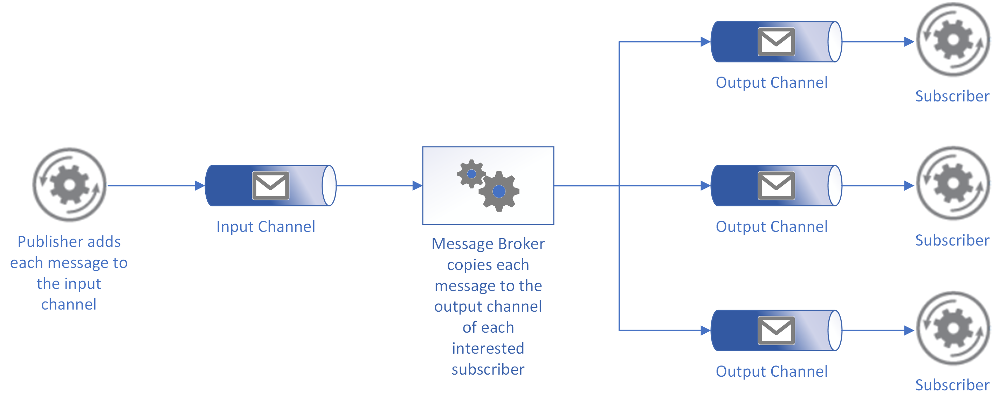

# Publisher-Subscriber pattern

[!INCLUDE [header](../_includes/header.md)]

Enable a sender to announce events to multiple interested receivers aynchronously, without coupling senders and receivers.

## Context and problem

Cloud-based applications often need to provide information to other applications as events happen. Asynchronous messaging is an effective strategy that decouples a sender from interested receivers and maintains the responsiveness of the sending application. However, using a dedicated message queue for each receivers does not effectively scale to many receivers. Additionally, some of the receivers might be interested in only a subset of the information. How can the application announce events to all interested revceivers without knowing their identities? 

> In this article, a "sender" is an application, service, microservice, or component that needs to broadcast information to interested "receivers" or "consumers", which are also applications, services, microservices, or components. In a publish-subscribe context, "consumer" has a different meaning than in contexts such as the [Competing Consumer](competing-consumers.md) pattern.

## Solution

Introduce an asynchronous messaging subsystem that includes the following:

- An input messaging channel used by the sender, known in this pattern as the publisher. The publisher packages each event into a message using a defined format known to its receivers. The publisher sends each of these messages via the input channel.

- One output messaging channel per receiver. These receivers are known in this pattern as subscribers. 

- A mechanism for copying each message from the input channel to the output channels for all subscribers interested in that message. This operation is typically handled by a intermediary process such as a message broker or event bus.

  

> Like other asynchronous message-based approaches, a publish-subscribe approach usually drives additional considerations (such as message filtering, duplicate message handling, and many others discussed below). Because of this, it is strongly recommended that you take advantage of available messaging products and services that support a publish-subscribe model rather than building your own. While this diagram depicts a basic publish-subscribe aprroach, each product or service has its own variation on this approach.

This solution has the following benefits:

- It decouples applications from one another. Applications can be managed independently, and messages can be properly managed even if one or more receiving applications are offline. Adhering to the [open/closed principle](https://en.wikipedia.org/wiki/Open/closed_principle) in the sending service allows new subscribers to be added without modifying the publisher.

- It increases scalability and improves responsiveness of the sending application. Sending applications can quickly send a single message to the input channel, then return to its core processing responsibilities. The messaging infrastructure bears the responsibility for ensuring messages are delivered to interested subscribers.

- It improves reliability. Asynchronous messaging strategies help applications continue to run smoothly under increased loads and handle intermittent failures more effectively.

- It allows for deferred or scheduled processing. Subscribers can wait to pick up messages until off-peak hours, or messages can be routed or processed according to a specific schedule. This ability may be somewhat restricted based on message expiration considerations, discussed further below.

- It enables simpler integration between systems using different platforms, programming languages, or communication protocols, as well as between on-premises systems and applications running in the cloud.

- It facilitates asynchronous workflows across an enterprise.

- It improves testability. Channels can be monitored and messages can be inspected or logged as part of an overall integration test strategy.

- It provides separation of concerns for your applications. Senders and receivers can focus on their core capabilities, while the messaging infrastructure handles everything required to reliably route messages from a sender to multiple receivers.  

## Issues and considerations

Consider the following points when deciding how to implement this pattern:

- **Subscription handling.** The messaging infrastructure must provide mechanisms that receivers can use to subscribe to or unsubscribe from available channels.

- **Security.** Connecting to any message channel must be restricted by security policy to prevent eavesdropping by unauthorized users or applications.

- **Subsets of Messages.** Subscribers are usually only interested in subset of the messages distributed by a publisher. Messaging services often allow subscribers to narrow the set of messages received by:
    - **Topics.** Each topic has a dedicated output channel, and each receiver can subscribe to all relevant topics.
    - **Content filtering.** Messages are inspected and distributed based on the content of each message. Each subscriber can specify the content it is interested in.  

- **Wildcard subscribers.** Consider allowing subscribers to subscribe to multiple topics via wildcards.   

- **Bi-directional communication.** The channels in a publish-subscribe system are treated as unidirectional. If a specific subscriber needs to send acknowledgement or communicate status back to the publisher, consider using the [Request/Reply Pattern](http://www.enterpriseintegrationpatterns.com/patterns/messaging/RequestReply.html). This pattern uses one channel to send a message to the subscriber, and a separate reply channel for communicating back to the publisher.

- **Message ordering.** The order in which messages are received by subscribers isn't guaranteed, and doesn't necessarily reflect the creation order of the messages. Many messaging services provide capabilities to ensure first-in-first-out (FIFO) ordering of messages.

- **Message priority.** Some solutions may require that messages are processed in a specific order. The [Priority Queue pattern](priority-queue.md) provides a mechanism for ensuring specific messages are delivered before others.

- **Poison messages.** A malformed message, or a task that requires access to resources that aren't available, can cause a service instance to fail. The system should prevent such messages being returned to a channel. Instead, capture and store the details of these messages elsewhere so that they can be analyzed if necessary. Many messaging services provide a dead-letter queue that can hold poison messages for later processing.

- **Repeated messages.** The same message might be sent more than once if, for example, the sender fails after posting a message but before completing any other work it was performing. Another sender could be started and run in its place, and this new sender could repeat the message. The messaging infrastructure may implement duplicate message detection and removal (also known as de-duping), usually based on message IDs, in order to provide at-most-once delivery of messages. If not, the receivers are responsible for either removing duplicate messages or implementing idempotent operations for message processing. Note that a de-duping process can affect system throughput.
    
- **Message expiration.** A message might have a limited lifetime, and if it isn't processed within this period it might no longer be relevant and should be discarded. The message data can include a time-to-live value or an expiration date/time value by which the message should be processed. A receiver can examine this information before deciding whether to perform the business logic associated with the message. Many messaging services move expired messages to a built-in dead-letter queue.

- **Message scheduling.** A message might be temporarily embargoed and should not be processed until a specific date and time. The message should not be available to a receiver until this time.

- **Message size.** If the amount of data associated with each message is significant, consider using a different storage mechanism such as file or blob storage for this data, and include a reference to it in the message.

- **Distinguish between events and messages.** It can be helpful to make a distinction between two types of datagrams typically published by a system: messages and events.
    - If a publisher has a certain expectation of how the published information item ought to be handled, and what audience should receive it (such as issuing a command, assigning a job, or handing over control of a collaborative activity), this is usually communicated in a message.
    - Events are intended to inform, but there is typically no expectation of how receivers will use that information. An event captures and conveys a fact. A receiver of the event can determine how to process the fact and doesn’t fulfill any specific expectations held by the publisher.
    - Services that provide publish-subscribe capabilities may be better suited to one or other other type of information (messages vs. events). For more information, see [Events, Data Points, and Messages](https://azure.microsoft.com/en-us/blog/events-data-points-and-messages-choosing-the-right-azure-messaging-service-for-your-data/).

## When to use this pattern

Use this pattern when:

- An application needs to broadcast information to multiple interested receivers.
- An application needs to communicate with one or more independently-developed receiving applications, which may use different platforms, programming languages, and communication protocols.
- An application can send information to receivers without expecting real-time responses.
- The systems being integrated are designed to support an eventual consistency model for their data. 
- An application needs to communicate information to various receivers that have different availability requirements or uptime schedules than the producing application.

This pattern might not be useful when:

- [Complex event processing](https://en.wikipedia.org/wiki/Complex_event_processing) systems will likely benefit from a broader event stream processing approach (such as those used in [Kafka](https://kafka.apache.org/) and [Azure Event Hubs](https://docs.microsoft.com/en-us/azure/event-hubs/event-hubs-what-is-event-hubs)).

## Example: Azure Event Grid

[Azure Event Grid](/azure/event-grid/overview) is a fully-managed intelligent event routing service. When a publisher (also called an event source) raises an event, Azure Event Grid sends the event via HTTP to all interested subscribers (also called an event handler). Because events can be raised from both custom applications and native Azure resources, and numerous options exist for enabling event handlers, Azure Event Grid provides a uniform, cloud-scale approach to enabling publish-subscribe model for your Azure application and resource events.

> Azure offers multiple services that assist with delivering event messages throughout a solution. Although they have some similarities, each service is designed for particular scenarios. In many cases, these services are complementary and can be used together. For more information on the differences between these services, see [Choose between Azure services that deliver messages](/azure/event-grid/compare-messaging-services).

  

Event Grid enables the following types of event sources:
    - Azure resources such as Blob storage and virtual machines raise events to system topics provided by Azure. Event handlers can [subscribe to the topics](/azure/storage/blobs/storage-blob-event-quickstart?toc=%2fazure%2fevent-grid%2ftoc.json) they are interested in. For a list of Azure-generated resource events, see [About Event Grid: Event sources](/azure/event-grid/overview#event-sources). 
    - An application can [create custom topics](/azure/event-grid/custom-event-quickstart) for raising its events. An application can categorize different types of events by defining multiple custom topics. Event handlers can also filter events to receive only those events they want to receive. For more information, see [Post to a custom topic for Azure Event Grid](https://docs.microsoft.com/en-us/azure/event-grid/post-to-custom-topic).

Event Grid also provides a number of approaches to handling events from event sources:
    - [Azure Functions](/azure/azure-functions/functions-overview) provides a [serverless approach](https://azure.microsoft.com/en-us/resources/videos/azure-serverless-end-to-end-with-functions-logic-apps-and-event-grid/) to running small pieces of custom code in Azure. You can focus on addressing a specific need without building an entire application or managing the underlying infrastructure. An Azure function can subscribe to an Event Grid topic and reactively run its code whenever an event is received. For more information, see [Handling Event Grid events in Azure Functions](https://docs.microsoft.com/en-us/azure/azure-functions/functions-bindings-event-grid). 
    - [Azure Automation](/azure/automation/automation-offering-get-started) automates manual processes using Powershell-based runbooks. A raised event can trigger a subsequent workflow defined in an automation runbook. For more information, see [Integrating Azure Automation with Event Grid](https://docs.microsoft.com/en-us/azure/event-grid/ensure-tags-exists-on-new-virtual-machines).
    - [Azure Logic Apps](/azure/logic-apps/logic-apps-overview) helps you easily integrate with other services and systems across enterprises or organizations. Hundreds of available connectors let you quickly create workflows across services that react to events raised via Event Grid. For an example, see [Monitor virtual machine changes with Azure Event Grid and Logic Apps](/azure/event-grid/monitor-virtual-machine-changes-event-grid-logic-app).

## Related patterns and guidance

The following patterns and guidance might be relevant when implementing this pattern:

- [Asynchronous Messaging Primer](https://msdn.microsoft.com/library/dn589781.aspx). Message queues are an asynchronous communications mechanism. If a receiving service needs to send a reply to an application, it might be necessary to implement some form of response messaging. The Asynchronous Messaging Primer provides information on how to implement request/reply messaging using message queues.

- [Observer Pattern](https://en.wikipedia.org/wiki/Observer_pattern). The Publish-Subscribe pattern builds on the Observer pattern by decoupling subjects from observers via asynchronous messaging.

- [Message Broker Pattern](https://en.wikipedia.org/wiki/Message_broker). Many messaging subsystems that support a publish-subscribe model are implemented via a message broker.

<!-- links -->

